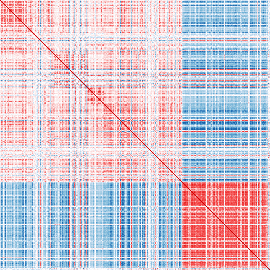
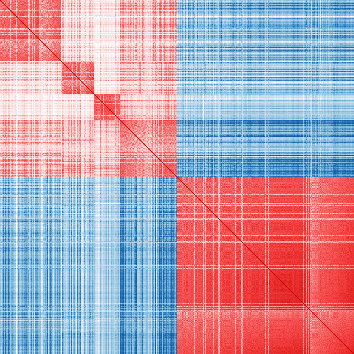
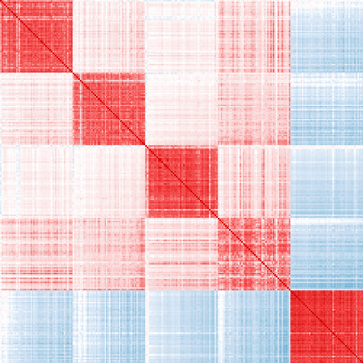

## MarkerPen

The `markerpen` R package uses penalized principal component analysis to
detect cell-type-specific marker genes from bulk tissue RNA sequencing data.
It is a semi-supervised algorithm that uses bulk transcriptome data to
refine a prior marker gene list.

### Installation

`markerpen` can be installed directly from CRAN:

```r
install.packages("markerpen")
```

A C++ compiler that supports the C++11 standard is needed to install `markerpen`
from source.

For best performance, it is **strongly suggested** linking your R to the
[OpenBLAS](https://www.openblas.net/) library for matrix computation, although
this step is optional. You can achieve this with the help of the
[ropenblas](https://prdm0.github.io/ropenblas/) package.

### Example

In this section we show a real example of selecting marker genes from
bulk tissue RNA sequencing data.

First, download the gene expression data set and load it into R:

```r
library(markerpen)
library(dplyr)
library(scales)

# Download data
# A subset of the ROSMAP data
dat_url = "https://github.com/ellispatrick/CortexCellDeconv/blob/master/CellTypeDeconvAnalysis/Data/geneExprRaw.txt?raw=true"
download.file(dat_url, destfile = "geneExprRaw.txt", method = "libcurl")

# Read in data - rows are genes, columns are observations
dat = read.table("geneExprRaw.txt", header = TRUE)
# Normalize read count
dat_norm = sweep(dat, 2, colSums(dat), "/")
# Convert gene name to Ensembl name
matched = tibble(name = rownames(dat_norm)) %>%
    inner_join(markerpen::gene_mapping, by = "name")
# Get expression matrix - rows are observations, columns are genes
mat_exp = t(dat_norm[matched$name, ])
colnames(mat_exp) = matched$ensembl
print(mat_exp[1:5, 1:5])
```

```
          ENSG00000121410 ENSG00000175899 ENSG00000166535 ENSG00000128274 ENSG00000094914
X57978756    7.944190e-06    4.208850e-05    2.541467e-06    1.375366e-05    3.173188e-05
X10518782    6.242954e-06    4.313521e-05    3.572706e-06    6.242954e-06    5.482147e-05
X50302004    1.178625e-05    9.508784e-05    2.600036e-06    9.699912e-06    6.176663e-05
X67429065    8.266322e-06    9.014051e-05    3.295705e-06    1.053372e-05    5.489613e-05
X20214850    9.708929e-06    9.450005e-05    1.316315e-05    2.276931e-05    4.761400e-05
```

Next, read in the prior marker gene lists, collected from the published
literature. We also restrict the search range for each cell type to a subset of the
whole genome.

The two R data files are provided in the `vignettes` folder.

```r
# Read in prior marker genes
load("vignettes/published_markers.RData")
load("vignettes/markers_range.RData")
```

Below is the main part of the analysis: selecting marker genes for major
cell types. After obtaining the marker genes for one cell type, we remove those
genes from the search range for the next cell type, in order to make markers for
different cell types non-overlapping. Theoretically the order of
the cell types in computing has an impact on the final result, but in practice
the impact is small if the cell types can be well separated.

```r
# Markers for astrocytes
ast_re = refine_markers(mat_exp, markers_range$astrocytes, pub_markers$astrocytes,
                        lambda = 0.4, w = 1.5, maxit = 500, verbose = 0)
# Remove selected markers from the expression matrix
mat_rest = mat_exp[, setdiff(colnames(mat_exp), ast_re$markers)]

# Markers for oligodendrocytes
oli_re = refine_markers(mat_rest, markers_range$oligodendrocytes, pub_markers$oligodendrocytes,
                        lambda = 0.4, w = 1.5, maxit = 500, verbose = 0)
mat_rest = mat_rest[, setdiff(colnames(mat_rest), oli_re$markers)]

# Markers for microglia
mic_re = refine_markers(mat_rest, markers_range$microglia, pub_markers$microglia,
                        lambda = 0.4, w = 1.5, maxit = 500, verbose = 0)
mat_rest = mat_rest[, setdiff(colnames(mat_rest), mic_re$markers)]

# Markers for endothelial
end_re = refine_markers(mat_rest, markers_range$endothelial, pub_markers$endothelial,
                        lambda = 0.4, w = 1.5, maxit = 500, verbose = 0)
mat_rest = mat_rest[, setdiff(colnames(mat_rest), end_re$markers)]

# Markers for neurons
neu_re = refine_markers(mat_rest, markers_range$neurons, pub_markers$neurons,
                        lambda = 0.4, w = 1.5, maxit = 500, verbose = 0)

# Refined markers
markers_re = list(astrocytes       = ast_re$markers,
                  oligodendrocytes = oli_re$markers,
                  microglia        = mic_re$markers,
                  endothelial      = end_re$markers,
                  neurons          = neu_re$markers)
```

We post-process the selected genes by ordering them and selecting
the top 50 markers for each cell type.

```r
# Post-process selected markers
# Pick the first 50 ordered markers
cor_markers = cor(mat_exp[, unlist(markers_re)])
markers_ord = sort_markers(cor_markers, markers_re)
markers_ord = lapply(markers_ord, head, n = 50)
```

Finally, visualize the sample correlation matrices on published
markers and refined markers.

```r
# Function to visualize the sample correlation matrix
vis_cor = function(mat_exp, markers)
{
    all_genes = colnames(mat_exp)
    markers = intersect(unlist(markers), all_genes)
    cor_markers = cor(mat_exp[, unlist(markers)])
    p = nrow(cor_markers)

    cols = c("#08306b", "#08519c", "#2171b5", "#6baed6", "#9ecae1", "#c6dbef", "#deebf7",
             "#ffffff",
             "#fcf1f1", "#fae1e1", "#facdcd", "#f49c9c", "#f56566", "#f13a3c", "#d00003")

    ncols = length(cols)
    cols = scales::gradient_n_pal(cols, values = (0:ncols) / ncols)((1:100) / 100)
    op = par(mar = c(0, 0, 0, 0))
    image(cor_markers[, p:1], col = cols, breaks = (-50:50) / 50, asp = 1, axes = FALSE)
    par(op)
}
```

Published markers:

```r
vis_cor(mat_exp, pub_markers)
```

<div align="center">
  
</div>
Refined markers:

```r
vis_cor(mat_exp, markers_re)
```

<div align="center">
  
</div>

Ordered top 50 markers for each cell type:

```r
vis_cor(mat_exp, markers_ord)
```

<div align="center">
  
</div>
